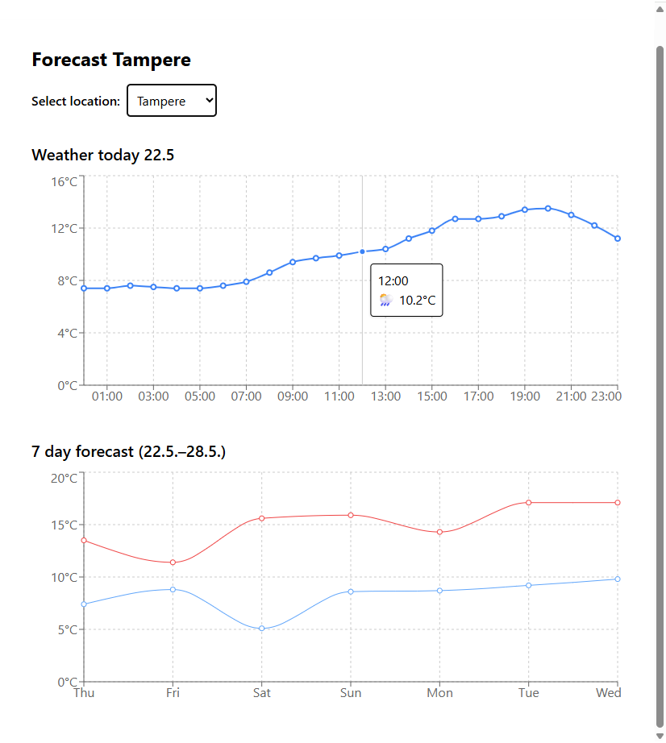

# 🐾 React Full Stack App

This is a full stack web application built with React (TypeScript), .NET 9 (C#), Entity Framework Core, SQLite, TailwindCSS, and open APIs. The app allows users to view and add data to SQLite database, calculate Fibonacci numbers, weather forecasts with interactive graphs and display random dog images.

---

## 📸 Screenshots

### Forecast Page


---

## ✨ Features

- ✅ Show hourly and 7-day weather forecasts (Open-Meteo API)
- ✅ Visualize weather data with graphs (Recharts)
- ✅ Responsive and styled UI with TailwindCSS
- ✅ Data stored locally in SQLite using Entity Framework Core
- ✅ View, add, edit, and delete facts
- ✅ Calculate Fibonacci numbers
- ✅ Display random dog images (Dog CEO API)


---

## 🛠 Technologies Used

### 🔹 Frontend
- [React](https://reactjs.org/)
- [TypeScript](https://www.typescriptlang.org/)
- [Vite](https://vitejs.dev/)
- [Tailwind CSS](https://tailwindcss.com/)
- [Recharts](https://recharts.org/)

### 🔹 Backend
- [.NET 9 (C#)](https://dotnet.microsoft.com/)
- [Entity Framework Core](https://learn.microsoft.com/en-us/ef/)
- [SQLite](https://www.sqlite.org/index.html)

### 🔹 APIs
- [Dog CEO API](https://dog.ceo/dog-api/)
- [Open-Meteo API](https://open-meteo.com/)

---

## 🚀 Installation & Setup

### 1. Clone the repository
```bash
git clone https://github.com/yourusername/fullstack-dog-app.git
cd fullstack-dog-app

### 2. Install frontend dependencies

cd client
npm install

### 3. Install backend dependencies

cd ../server
dotnet restore

### 4. Set up the database

dotnet ef database update

### 5. Run the application

Backend

cd server
dotnet run

Frontend

cd client
npm run dev

📁 Project Structure

/client        # React frontend (TypeScript, Vite, TailwindCSS and Recharts)
/server        # .NET 9 backend with SQLite + EF Core
/screenshots   # App screenshots for README

📄 License

This project is licensed under the MIT License.
